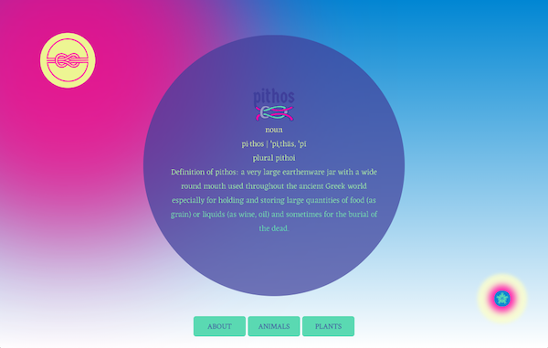
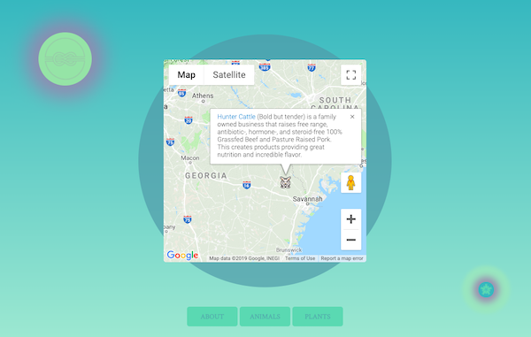
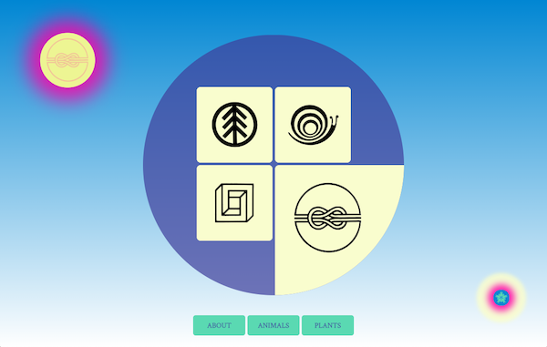
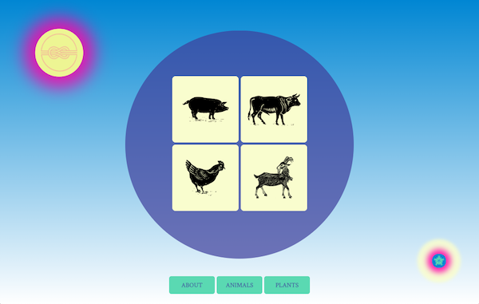
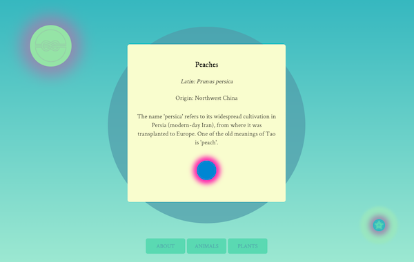

# FrontEndProject_JimJasonKatie

# Pithos

* Description
* Technologies
* Challenges and Solutions
* MVP
* Stretch Goals
* Authors

# Description
We wanted to create a space that would allow the user to experience an 'ordinary' thing in an unusual way. We were interested in ecosystems, and wanted to connect our ecosystem to the state of Georgia (home), and also the larger realms of history, mythology, and health; which are their own kinds of ecosystems, or containers. <i>Pithos</i>.

# Technologies
- HTML
- CSS
- JavaScript
- jQuery
- Google Maps API
- Open Weather Map API (WIP)

# Challenges & Solutions

- Challenge: the map loaded rather erratically ON the page, especially on different devices or when the screen was resized.
    - Solution: We wrote JS to detect window size and anchor the map to either the circle or the compass so it was always visible to the user.
- Challenge: the design was heavily oriented to the horizontal. 
    - Solution: Several edits and re-designs had to be implemented for mobile and tablet-portrait.
- Challenge: Animating the images within the circle made them so large they were clipped by the edge of the circle.
    - Solution: Created separate DIV elements for the background color and the image, and animated them at different rates and to a different target size.
    
- Challenge: We didn't initially write the CSS mobile-first, so we had a lot of refactoring to do anytime we redesigned something.
    - Solution: Next time, we'll start mobile-first!

# MVP
A front-end-only website that is informative and aesthetically pleasing . It enables the user to learn about some of the history and mythology around plants and animals commonly farmed in Georgia. The user can also click on a map to see where various Georgia farms are located. 
- A graphic display that corresponds to written info
- Written info stored in JS object
- Simple map with a few Georgia Farms located (using Google maps API)
- Illustrations of each farm animal/plant
- Color theme, fonts, beautiful and user-friendly layout
- Modals for information on each animal/plant when clicked
- Navigation bar with plants/animals/about
- Responsive designs for desktop, tablet, and phone
- Use of grid layout

# Stretch Goals
- Use of CSS animations for hover as well as certain click functions (reached)
- Customized map with information on Georgia farms that actively farm the plants/animals we present on our website (reached)
- Fade animations on modal/backdrop for peaceful effect (reached)
- Background color that corresponds to weather API and/or time (still a WIP)

# Authors
- Katie Duane
  - Contributions: Concept, wireframes, CSS for mobile and tablet, colors and fonts, Javascript for 'Animal' and 'Plant' pages, modals, and displaying data about each plant/animal, JavaScript for map positioning on mobile and tablet. Plant and animal research.
  - [GitHub Profile](https://github.com/katiejduane)

- Jason Benson
  - Contributions: Concept, wireframes, final wireframe and design, CSS for tablet and desktop, CSS animations, colors & fonts, image editing, Javascript for 'About' page, design for opening page, Pithos logo, Pithos research.
  - [GitHub Profile](https://github.com/jasonpbenson)
  
- Jim Owens
  - Contributions: Boilerplate HTML and CSS, Javascript for Google Maps API and map usability, animal and local farm research, Javascript for Farm Search Object, data organization, code cleanup.
  - [GitHub Profile](http://github.com/jimboowens)

  